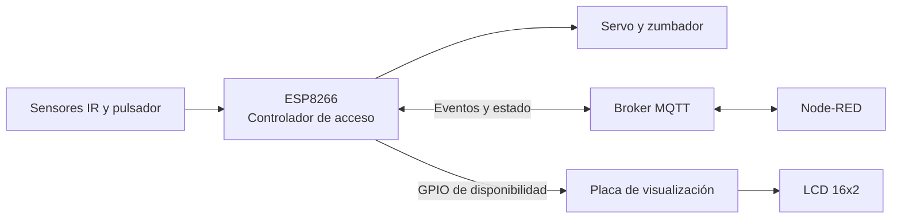

# Smart Parking · IoT


Prototipo académico de un sistema de acceso para estacionamiento inteligente. Un ESP8266 detecta el movimiento de vehículos, controla una barrera y comunica eventos por MQTT; una segunda placa muestra la disponibilidad en una pantalla LCD 16x2.


## Funcionalidades

- Detección de entrada y salida mediante dos sensores infrarrojos.
- Apertura y cierre de barrera con servomotor y aviso acústico.
- Solicitud de salida mediante pulsador.
- Confirmación remota de acceso y recepción del estado de disponibilidad por MQTT.
- Publicación del estado de conexión mediante *Last Will and Testament* (LWT).
- Visualización de `LIBRE` o `COMPLETO` en una pantalla LCD independiente.
- Flujo Node-RED importable para inspeccionar eventos y simular estados.

> [!NOTE]
> El repositorio implementa el control de acceso y la señalización. El reconocimiento de matrículas, la monitorización ambiental y la gestión individual de plazas quedan como posibles ampliaciones.

## Arquitectura



El ESP8266 publica los eventos detectados y espera la confirmación de acceso desde el broker. Node-RED representa el sistema externo que consume esos eventos y devuelve los estados de confirmación o disponibilidad.

## Hardware

- Placa ESP8266 para el controlador de acceso.
- Placa compatible con Arduino para la pantalla.
- Dos sensores infrarrojos.
- Servomotor.
- Zumbador pasivo.
- Pulsador.
- Pantalla LCD 16x2 compatible con `LiquidCrystal`.
- Fuente de alimentación, protoboard y cableado.

### Pines del controlador ESP8266

| Componente | GPIO | Modo |
| --- | ---: | --- |
| Servomotor | 4 | Salida PWM |
| Zumbador | 16 | Salida |
| Pulsador | 12 | Entrada con `INPUT_PULLUP` |
| Sensor IR exterior | 5 | Entrada |
| Sensor IR interior | 14 | Entrada |
| Señal de disponibilidad | 2 | Salida |

La conexión detallada de la segunda placa está disponible en [docs/lcd-display.md](docs/lcd-display.md).

> [!WARNING]
> Alimenta el servomotor con una fuente adecuada y une las masas de todos los módulos. Verifica también la compatibilidad de niveles lógicos entre el ESP8266 (3,3 V) y la placa de visualización.

## Software necesario

- Arduino IDE o una herramienta equivalente para compilar y cargar los sketches.
- Soporte de placas ESP8266 para Arduino.
- Bibliotecas `ArduinoJson`, `PubSubClient` y `Servo` para el controlador.
- Biblioteca `LiquidCrystal` para la pantalla.
- Node-RED y un broker MQTT, opcionales para probar el flujo incluido.

## Puesta en marcha

### 1. Clonar el repositorio

```bash
git clone https://github.com/angelengineer/ProyectoIoT.git
cd ProyectoIoT
```

### 2. Configurar el controlador

Crea la configuración local a partir de la plantilla:

```bash
cp firmware/access-controller/config.example.h \
   firmware/access-controller/config.h
```

Edita `config.h` con los datos de tu red Wi-Fi, broker MQTT, credenciales y prefijo de topics. El archivo está incluido en `.gitignore` y no debe subirse al repositorio.

### 3. Cargar los sketches

1. Abre `firmware/access-controller/access-controller.ino` en Arduino IDE.
2. Instala las bibliotecas indicadas, selecciona la placa ESP8266 y carga el sketch.
3. Abre `firmware/lcd-display/lcd-display.ino` en una segunda ventana.
4. Selecciona la placa conectada a la pantalla y carga el sketch.

### 4. Importar el flujo de Node-RED

1. Abre Node-RED y selecciona **Menu → Import**.
2. Importa `node-red/parking-entry-flow.json`.
3. Edita el nodo de configuración **MQTT broker** con el host, puerto y credenciales de tu entorno.
4. Si cambiaste `MQTT_TOPIC_PREFIX`, actualiza también los topics de los nodos MQTT. El flujo usa `parking` como valor inicial.
5. Despliega el flujo.

## Contrato MQTT

`<prefix>` corresponde al valor de `MQTT_TOPIC_PREFIX` en `config.h`.

| Topic | Dirección respecto al ESP8266 | Uso | Ejemplo |
| --- | --- | --- | --- |
| `<prefix>/ACCESO` | Publicación | Evento detectado | `{"detectado":"1","entrada":"0","salida":"0"}` |
| `<prefix>/ACCESO/ESTADO` | Suscripción | Confirmación o disponibilidad | `{"confirmado":true}` |
| `<prefix>/ACCESO/conexion` | Publicación retenida | Estado LWT del dispositivo | `{"online":true}` |

Los campos de evento se publican actualmente como cadenas `"0"` y `"1"`. Los campos de estado `confirmado` y `libre` se reciben como booleanos y deben enviarse en mensajes separados.

## Estructura del repositorio

```text
.
├── docs/
│   └── lcd-display.md
├── firmware/
│   ├── access-controller/
│   │   ├── access-controller.ino
│   │   └── config.example.h
│   └── lcd-display/
│       └── lcd-display.ino
├── node-red/
│   └── parking-entry-flow.json
├── .gitignore
└── README.md
```

Los sketches se encuentran en carpetas separadas porque Arduino concatena todos los archivos `.ino` de una misma carpeta. Esta estructura evita conflictos entre sus respectivas funciones `setup()` y `loop()`.

## Seguridad y limitaciones

- No guardes redes, contraseñas ni tokens en archivos versionados.
- El ejemplo utiliza MQTT sin TLS en el puerto 1883; para un despliegue real, usa transporte cifrado, autenticación y autorización por topic.
- La lógica de sensores contiene esperas bloqueantes. Para operación continua conviene migrarla a una máquina de estados no bloqueante que mantenga activo el cliente MQTT.
- El prototipo no incluye pruebas automatizadas ni simulación de hardware.

## Equipo

Proyecto desarrollado para Informática Industrial — GIERM, Grupo 12 (2023):

- Angel Muñoz Rocha
- Pablo Morilla Cabello
- Claudia Ada Perez Pastor
- Antonio Pozo Leon

## Licencia

Este repositorio no define actualmente una licencia de software. Añade una antes de reutilizar o distribuir el código fuera del contexto académico.
